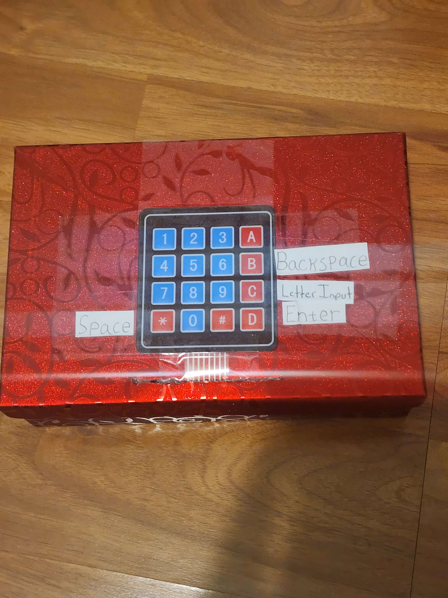
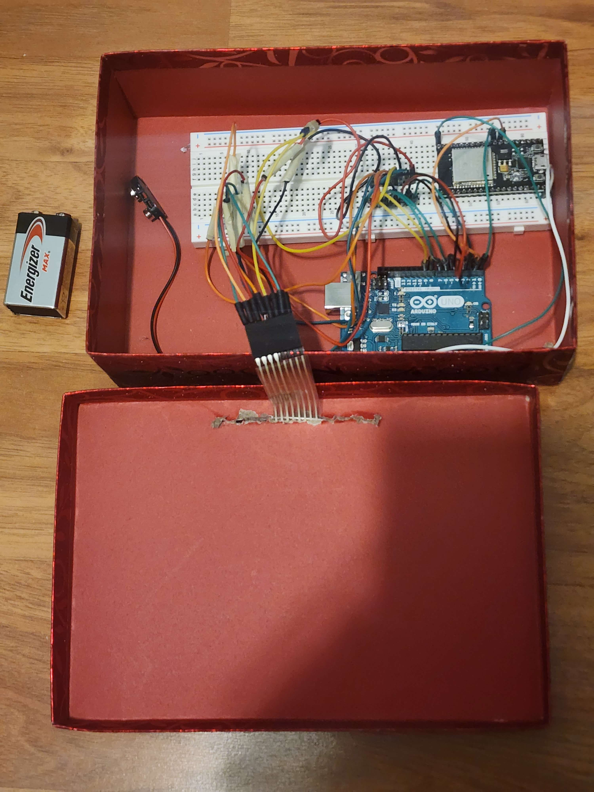

# Braille Wireless
Wireless keypad that takes in decodes braille pattern and passes it over from arduino to esp32 and then to bluetooth device.
### Opportunity
The significance of our project is to aid people who are unable to see. Unfortunately,  many people are born blind or have lost their vision. With this opportunity we can use the Arduino kit components to create a design to assist these people in making their life easier.

### Photos

